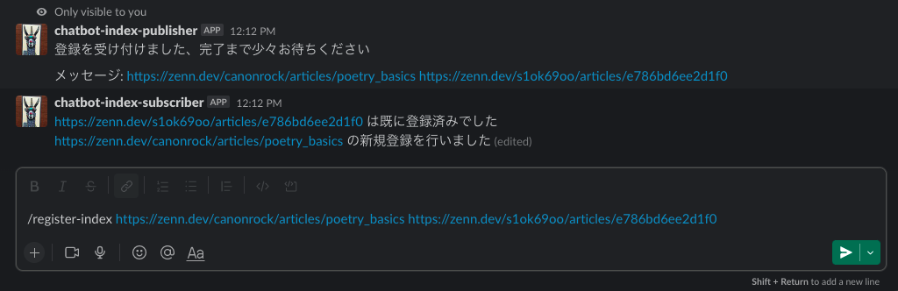
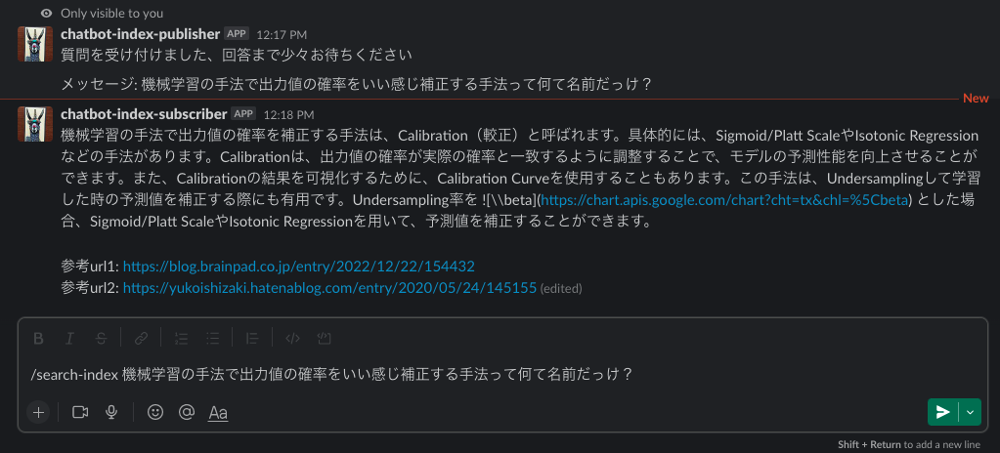
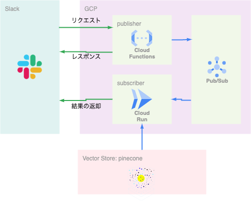

chatgpt-index-bot
========

LllmaIndexのIndexサーチ機能を利用したSlackボット


# DEMO

- slack上で/register-index `url`と入力することで、記事の登録を行う


- slack上で/search-index `質問文`と入力することで、事前に登録された記事を元に回答を作成する


# Features

## システム概要

- リクエスト受付用のpublisherと処理＋検索用のsubscriberの2モジュールからなる
- 2モジュール作成しているのは、slackbotの[3秒ルール](https://api.slack.com/interactivity/handling#acknowledgment_response)に対応するため
- publisherとsubscriber間の通信にはPub/Subを利用



## 機能

主に以下の2つの機能を実装

- 検索機能
- 登録機能

それぞれslackのslash command（/search-index, /register-index）として登録している

検索機能では、slack上で受け付けた質問に対して、indexサーチを行い、返答を行う

登録機能では、slack上で受け付けた、URLの内容をパースし、新たにindexとして登録する

# Requirement

必要なpythonライブラリはpoetryで管理している

- [publisher](publisher/pyproject.toml)
- [subscriber](subscriber/pyproject.toml)

またデプロイのために[terraform](terraform/versions.tf)を利用

# Installation

以下のファイルを事前に準備する

terraformビルドのための環境変数ファイルをterraform/terraform.tfvarsに配置

形式と必要な変数は以下

```
project = "GCPのプロジェクト名"
slack_bot_token = "publisherのslack-bot-token"
slack_singing_secret = "publisherのslack-singing-secret"
slack_webhook_url = "subscriberがpostするslackのwebhook"
openai_api_key = "OPENAIのAPIキー"
pinecone_api_key = "PINECONEのAPIキー"
pinecone_environment = "PINECONEのリージョン"
index_name = "PINECONEのインデックス名"
```

デプロイの方法以下

```
$ cd terraform && terraform init
$ make deploy
```