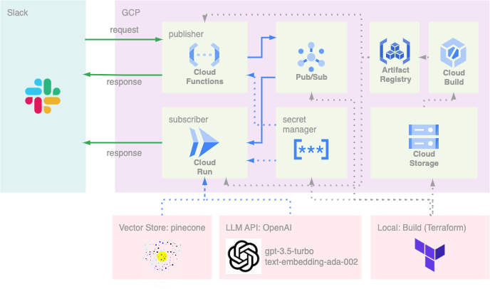

chatgpt-index-bot
========

LllmaIndexのIndexサーチ機能を利用したSlackボット


# DEMO


# Features

## システム概要

リクエスト受付用のpublisherと処理＋検索用のsubscriberの2モジュールからなる

publisherはcloudfunctions、subscriberはcloudrunで構築

publisherとsubscriber間の通信にはPub/Subを利用



## 機能

主に以下の2つの機能を実装

- 検索機能
- 登録機能

それぞれslackのslash command（/search-index, /register-index）として登録している

検索機能では、slack上で受け付けた質問に対して、indexサーチを行い、返答を行う

登録機能では、slack上で受け付けた、URLの内容をパースし、新たにindexとして登録する

# Requirement

必要なpythonライブラリはpoetryで管理している

- [publisher](publisher/pyproject.toml)
- [subscriber](subscriber/pyproject.toml)

またデプロイのために[terraform](terraform/versions.tf)を利用

# Installation

以下のファイルを事前に準備する

terraformビルドのための環境変数ファイルをterraform/terraform.tfvarsに配置

形式と必要な変数は以下

```
project = "GCPのプロジェクト名"
slack_bot_token = "publisherのslack-bot-token"
slack_singing_secret = "publisherのslack-singing-secret"
slack_webhook_url = "subscriberがpostするslackのwebhook"
openai_api_key = "OPENAIのAPIキー"
pinecone_api_key = "PINECONEのAPIキー"
pinecone_environment = "PINECONEのリージョン"
index_name = "PINECONEのインデックス名"
```

デプロイの方法以下

```
$ cd terraform && terraform init
$ make deploy
```

# Usage

検索機能はSlackのチャンネル上で以下を実施

```
/search-index Pub/Subについて教えてだくさい
```

登録機能はSlackのチャンネル上で以下を実施

```
/register-index https://xxxxxxxxxxx.com
```